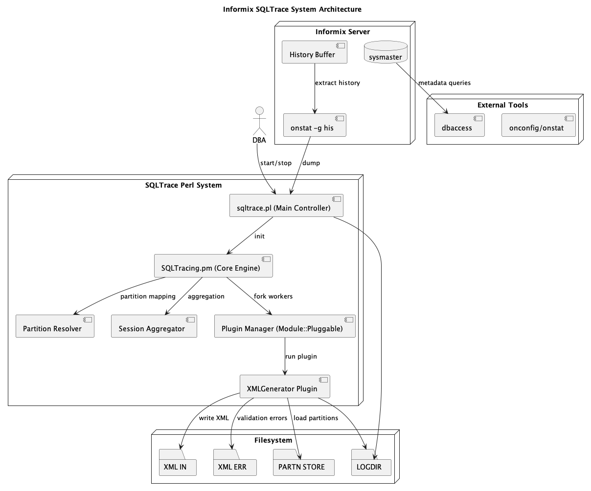

# Informix SQLTrace System

## Overview

This is part of a Perl-based Informix monitoring and SQL analysis framework designed to improve visibility of query behaviour over time.

The system captures SQL execution history from Informix, reconstructs execution behaviour, aggregates performance metrics, and outputs structured XML reports.

Its primary purpose is to support **historical analysis**, enabling detection of:
- changes in execution plans
- performance regressions (execution time, IO, etc.)
- shifts in query volume and behaviour

---

## Purpose of This Component

This specific component is responsible for:

- Collating SQL trace sample data into structured XML
- Validating XML against defined DTD/XSD schemas
- Writing validated output to a directory for downstream processing

The output is then consumed by an importer process, which loads the data into a database (e.g. Informix, MySQL, PostgreSQL).

That database is subsequently used by monitoring systems to:
- detect query performance degradation
- highlight execution plan changes
- identify anomalous workload patterns

---

## How It Works

### Data Processing Flow

1. Informix generates SQL trace history
2. The system extracts this data using `onstat -g his`
3. The Perl parser processes:
   - SQL statement text
   - execution statistics
   - iterator-based execution plan data
4. Queries are grouped using MD5 hashing
5. Execution plans are reconstructed and associated with queries
6. Metrics are aggregated per query and execution plan
7. XML output is generated and validated
8. Output is written for downstream ingestion

---

## XML Output Example

Below is a sample of the generated XML output structure:

```xml
<Query md5="qg53XxQZeZXY6sHtpsJKPQ" sql_type="INSERT" total_time="37.6721" total_executions_in_sample="1" total_explains="1">
  <QueryText>
    -- stmt: worker::select_root_ids::tsgbetresponse
    insert into tmparcsgbetresponse_xxxxx_xxxxx (sg_response_id)
    select first 5000 sg_response_id
    from tsgbetresponse
    where sg_response_id >= ?
      and ((sg_response_id > ? or (sg_response_id is not null and ? is null)))
      and (
        exists (
          select 1
          from tSGBet
          where tSGBet.sg_bet_id = tSGBetResponse.sg_bet_id
            and tSGBet.payout_try_reset_date is not null
            and tSGBetResponse.cr_date <= tSGBet.payout_try_reset_date
        )
      )
    order by sg_response_id asc
  </QueryText>

  <ExplainPlans>
    <ExplainPlan md5="UCXUrVeyQ5mBMfN9/hh4pg"
                 min_execution_time="37.6721"
                 max_execution_time="37.6721"
                 total_executions="1">
      <PlanText>
        Seq Scan(openbet_pte:tsgbet,fundbs06),
        Index Scan(openbet_pte:isgbetresponse_fk1,fundbs07),
        temp_table(Insert)
      </PlanText>
    </ExplainPlan>
  </ExplainPlans>

  <Executions>
    <Execution sid="37593"
               cost="3602471"
               time="2020-01-08 09:57:31"
               user_id="505"
               total="1"
               execute_time="37.6721"
               plan_md5="UCXUrVeyQ5mBMfN9/hh4pg"/>
  </Executions>
</Query>

<Query md5="6qxc28KsPGrtuAuPbok6Vg" sql_type="SELECT" total_time="12.7395" total_executions_in_sample="1" total_explains="1">
  <QueryText>
    select count(ev_mkt_id)
    from tEvMkt m, tEvUnstl u
    where m.auto_traded = "Y"
      and m.status = "A"
      and m.ev_id = u.ev_id
      and bet_in_run = 'Y'
  </QueryText>

  <ExplainPlans>
    <ExplainPlan md5="6NAAFZ3eYYPaHhwptsf2dg"
                 min_execution_time="12.7395"
                 max_execution_time="12.7395"
                 total_executions="1">
      <PlanText>
        Seq Scan(openbet_pte:tevunstl,fundbs03),
        Index Scan(openbet_pte:ievmkt_x2,vlatidx05)
      </PlanText>
    </ExplainPlan>
  </ExplainPlans>

  <Executions>
    <Execution sid="47536"
               cost="261130"
               time="2020-01-08 09:57:30"
               user_id="505"
               total="1"
               execute_time="12.7395"
               plan_md5="6NAAFZ3eYYPaHhwptsf2dg"/>
  </Executions>
</Query>
``
---
## Features

- Captures Informix statement history (`onstat -g his`)
- Groups SQL using MD5 hashing for aggregation
- Reconstructs execution plans from iterator output
- Maps partition numbers to schema objects
- Collects performance metrics:
  - execution time
  - IO waits
  - buffer usage
  - locks and sorts
- Multi-process plugin architecture
- XML report generation (DTD validated)
- Configurable logging and alerting
- Automatic restart of failed workers

---

## Architecture



## Requirements

### Informix

- IBM Informix Dynamic Server
- sysmaster access
- `onstat` command available in PATH
- `dbaccess` installed

### Perl modules

- strict / warnings
- Getopt::Std
- FindBin
- Parallel::ForkManager
- XML::LibXML
- Digest::MD5
- Storable
- Expect
- Log::Writer (custom)
- General::Config (custom)
- General::Iscan (custom)

---

## Installation

```bash
cd sqltrace_perl

export INFORMIXSERVER=your_instance
export ONCONFIG=your_onconfig
```

---

## Configuration

Example config:

```
LOGDIR=/var/crash/INST1/sqltrace
LOGFILE=/var/crash/INST1/sqltrace/sqltrace.log
INFOLOG=/var/crash/INST1/sqltrace/sqltrace_info.log
LOCKDIR=/var/crash/INST1/sqltrace/
INDIR=/var/crash/INST1/sqltrace/xml_in
OUTDIR=/var/crash/INST1/sqltrace/xml_out
ERRDIR=/var/crash/INST1/sqltrace/xml_err
PARTNSTORE=/var/crash/INST1/sqltrace/.partnstore
LOCKFILE=.sqltrace_check
MAILFROM=admin@example.com
MAILRECP=admin@example.com
LOGLEVEL=debug
DATABASE=informix
DTD=/opt/informix/schemas/ClaranetSQLTrace.dtd
SPECIAL_SQL=/opt/informix/configs/special_queries.txt
XMLGENERATOR_SLEEP=30
FORCE_STOP=0
```

---

## Enabling SQL Trace in Informix

Before running the tool, enable SQL tracing:

```sql
EXECUTE FUNCTION task("set sql tracing on", 100000,"8k","med","openbet");
```

Run via:

```bash
echo 'EXECUTE FUNCTION task("set sql tracing on", 100000,"8k","med","openbet");' | dbaccess sysadmin
```

---

## Running

Start the tracer:

```bash
perl sqltrace.pl -f config.conf -s INFORMIXSERVER
```

---

## Output

The system generates XML files:

```
/var/crash/INST1/sqltrace/xml_in/sqltracer_YYYYMMDDHHMMSS.xml
```

If validation fails, files are written to:

```
/xml_err/
```

---

## Data Flow

1. Informix writes statement history
2. `onstat -g his` extracts history buffer
3. Perl parser extracts:
   - SQL text
   - execution stats
   - iterator plan
4. SQL grouped via MD5 hash
5. Partition numbers resolved via sysmaster maps
6. XML generated per interval
7. Output written to disk

---

## Plugin System

Plugins are loaded dynamically using:

- Module::Pluggable

Each plugin runs in a forked process:

- XMLGenerator (main output engine)
- Additional plugins can be added under `SQLTracing::Plugin::*`

---

## Key Design Notes

- Uses Informix history buffer (not runtime interception)
- Heavy reliance on `onstat` output parsing
- Designed for batch analytics

---

## Limitations
- No true real-time query plan capture
- Sensitive to Informix output format changes
- Temporary file based parsing
- Plan reconstruction is heuristic

---

## Maintenance Notes

- Ensure `/sqltrace/` directory has sufficient space
- Rotate logs regularly
- Monitor for orphaned PID files
- Validate Informix `onstat` access

